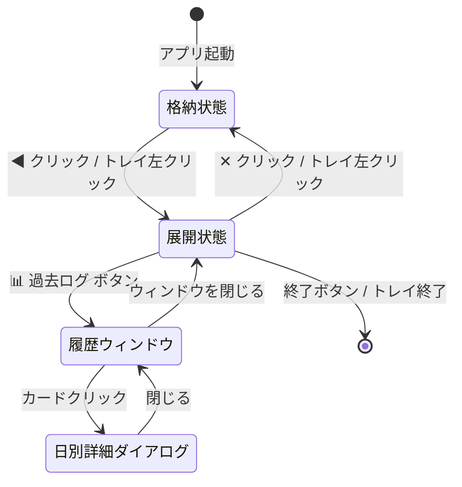

# SlideTasks — 要件定義書

## 1. プロジェクト概要

| 項目 | 内容 |
|---|---|
| **アプリ名** | SlideTasks |
| **種別** | Windows デスクトップ常駐アプリケーション |
| **概要** | 画面右端に常駐し、ワンクリックでスライド展開するTODOリストアプリ。日次の進捗管理と Google Tasks 連携に対応。 |
| **対象OS** | Windows 10 / 11 |
| **技術スタック** | Python 3.12+, PyQt6, SQLite, matplotlib, Google Tasks API |

---

## 2. 解決する課題

- TODOアプリを「わざわざ開く」手間を排除し、**常に画面端でアクセス可能**にする
- 1日の達成度を可視化し、**タスク消化のモチベーション**を維持する
- Google Tasks との同期で、**モバイルとの連携**も可能にする

---

## 3. 機能要件

### 3.1 メインウィンドウ（常駐UI）

| ID | 機能 | 詳細 |
|---|---|---|
| F-01 | **ホバーゾーン表示** | 画面右端に幅36px × 高さ60pxの透明なホバーゾーンを常時表示。マウスオーバーでトグルボタン（◀）を視覚的にハイライト。 |
| F-02 | **スライドアニメーション** | トグルボタンクリックで幅340pxのパネルをスライド展開。透明な固定ウィンドウ内で内部ウィジェットをアニメーションさせUIの振動を防ぐ。 |
| F-03 | **フレームレスウィンドウ** | タイトルバーなし。`AlwaysOnTop` + `Tool` ウィンドウとして動作し、タスクバーに表示しない。 |
| F-04 | **日付表示** | ヘッダーに今日の日付（例：`2月21日 (金)`）を表示。 |
| F-05 | **進捗プログレスバー** | 今日のタスク達成率をパーセント表示 + グラデーション付きバーで可視化。 |
| F-06 | **終了ボタン** | 展開されたパネル内下部に明示的な「Quit（終了）」ボタンを配置し、アプリの終了を容易にする。 |

### 3.2 タスク管理

| ID | 機能 | 詳細 |
|---|---|---|
| F-10 | **タスク追加** | テキスト入力欄 + Enterキーでタスクを追加。追加時にフェードインアニメーション。 |
| F-11 | **期限設定** | カレンダーアイコンボタンからポップアップカレンダーで期限日を選択可能。未指定時は当日をデフォルト設定。 |
| F-12 | **タスク編集** | 登録済みタスクの内容（テキスト）を変更・編集可能にする。 |
| F-13 | **タスク完了** | チェックボックスのトグルで完了/未完了を切り替え。完了時：取り消し線 + イタリック + 色の変更。 |
| F-14 | **タスク削除** | 各タスクの「×」ボタンで即座に削除（確認ダイアログなし）。 |
| F-15 | **並び順（ソート）** | 未完了タスクを上、完了済みタスクを下にし、期限日や追加日時などを基準に一覧を自動ソートする。 |
| F-16 | **期限超過表示** | 期限が過去日のタスクは赤色で「期限切れ」と表示。当日は緑色で「今日」と表示。 |
| F-17 | **タスクカウンター** | 「完了数 / 総数 タスク」をリアルタイム表示。 |
| F-18 | **空状態表示** | タスクがゼロのとき、絵文字 + メッセージ「タスクを追加してみよう！」を中央に表示。 |

### 3.3 日次リセット

| ID | 機能 | 詳細 |
|---|---|---|
| F-20 | **自動日次リセット** | 日付が変わったことを1分間隔のタイマーで検知。 |
| F-21 | **前日統計の保存** | リセット時に前日の（タスク総数, 完了数）を `daily_logs` テーブルに UPSERT。 |
| F-22 | **完了タスクのアーカイブ** | リセット時に完了済みタスクを非表示化（`is_done = 1` のレコードを削除）。 |

### 3.4 過去ログ・履歴閲覧

| ID | 機能 | 詳細 |
|---|---|---|
| F-30 | **履歴ウィンドウ** | 別ウィンドウで過去の達成状況を閲覧。 |
| F-31 | **表示期間切替** | 「週」「月」「年」の3段階で切り替え可能。◀▶ボタンで表示期間をナビゲート。 |
| F-32 | **棒グラフ表示** | matplotlib で達成率（完了/総数）を棒グラフ描画。100%は緑、0%は赤のグラデーション。 |
| F-33 | **カード形式リスト** | 各日付をカード形式で一覧表示。日付・タスク数・達成率をバッジで色分け。 |
| F-34 | **日別タスク詳細** | カードクリックでその日のタスク一覧（完了/未完了の区別付き）をダイアログ表示。 |
| F-35 | **日本語フォント対応** | グラフ内の日本語表示に「Yu Gothic UI」等の日本語フォントを使用。 |

### 3.5 Google Tasks 連携

| ID | 機能 | 詳細 |
|---|---|---|
| F-40 | **OAuth 2.0 認証** | `credentials.json` が存在すれば自動で Google OAuth 認証フローを開始。`token.json` をローカル保存。 |
| F-41 | **双方向同期** | 起動時にフル同期（Pull → Push）。以降は定期ポーリング（60秒間隔）。 |
| F-42 | **リアルタイムPush** | ローカルでのタスク追加・完了トグル・削除を即座に Google Tasks へ反映。 |
| F-43 | **Pull同期** | Google Tasks 側の変更（追加・完了・削除・期限変更）をローカルDBに反映し、UIを更新。 |
| F-44 | **任意連携** | `credentials.json` が無い場合はオフラインモードとして正常動作。エラーにならない。 |

### 3.6 システムトレイ

| ID | 機能 | 詳細 |
|---|---|---|
| F-50 | **トレイアイコン** | システムトレイにアイコンを表示。左クリックでパネルの展開/格納をトグル。 |
| F-51 | **トレイメニュー** | 右クリックメニュー：表示/非表示、手動同期、スタートアップ登録ON/OFF、アプリ終了。 |
| F-52 | **同期ステータス** | 同期中は「同期中…」、完了後は「最終同期: HH:MM」をメニューに表示。 |

### 3.7 Windows 統合

| ID | 機能 | 詳細 |
|---|---|---|
| F-60 | **スタートアップ登録** | Windowsレジストリ（`HKCU\...\Run`）経由でOS起動時に自動起動を登録/解除。 |
| F-61 | **EXEビルド** | PyInstaller で単一EXEファイルにビルド可能。`--onefile --noconsole` オプション。 |

---

## 4. 非機能要件

### 4.1 UI / UX

| ID | 要件 | 詳細 |
|---|---|---|
| NF-01 | **プレミアムダークテーマ** | 漆黒ネイビー基調（`#0f0f1a`）＋バイオレットアクセント（`#8b5cf6`）。グラスモーフィズム風、グラデーション、グロー効果。 |
| NF-02 | **マイクロアニメーション** | スライド展開、タスク追加時フェードイン、チェック完了時のスタイル変化。 |
| NF-03 | **フォント** | Segoe UI Variable / Yu Gothic UI（Windows標準の美しい日本語フォント）。 |
| NF-04 | **作業妨害の最小化** | 格納時は36px幅のみ。他アプリの操作を基本的に妨げない。 |

### 4.2 データ

| ID | 要件 | 詳細 |
|---|---|---|
| NF-10 | **ローカルDB** | SQLite (`data/slidetasks.db`) で永続化。ネットワーク不要で動作。 |
| NF-11 | **テーブル構成** | `tasks`（id, title, is_done, due_date, created_at, completed_at, google_task_id）, `daily_logs`（date, total, done, rate） |
| NF-12 | **タイムゾーンの統一** | 日時はすべて「UTC（協定世界時）」として扱い、UI表示時のみローカル時刻（システムのタイムゾーン）に変換する。 |

### 4.3 パフォーマンス・信頼性

| ID | 要件 | 詳細 |
|---|---|---|
| NF-20 | **低リソース消費** | 常駐アプリのため、アイドル時のCPU/メモリ消費を最小限に。 |
| NF-21 | **同期エラーの耐性** | Google API 障害時もローカル機能が正常動作すること。同期はフォールバック可能。 |
| NF-22 | **エラー通知・ログ出力** | エラー発生時は通知等でユーザーに知らせ、詳細は内部ログ(`app.log`)に出力してトラブルシューティングに役立てる。 |

---

## 5. データベース設計

```sql
-- タスクテーブル
CREATE TABLE tasks (
    id            INTEGER PRIMARY KEY AUTOINCREMENT,
    title         TEXT    NOT NULL,
    is_done       INTEGER DEFAULT 0,      -- 0: 未完了, 1: 完了
    due_date      TEXT,                    -- YYYY-MM-DD (NULL可)
    created_at    TEXT    NOT NULL,        -- YYYY-MM-DD HH:MM:SS
    completed_at  TEXT,                    -- 完了日時 (NULL可)
    google_task_id TEXT                    -- Google Tasks ID (NULL可)
);

-- 日次ログテーブル
CREATE TABLE daily_logs (
    date  TEXT    PRIMARY KEY,            -- YYYY-MM-DD
    total INTEGER NOT NULL,
    done  INTEGER NOT NULL,
    rate  REAL    DEFAULT 0.0             -- done / total (0.0〜1.0)
);
```

---

## 6. 画面遷移図



---

## 7. ファイル構成

```
todo_list/
├── main.py                  # エントリーポイント
├── requirements.txt         # 依存パッケージ
├── build.py                 # PyInstaller ビルドスクリプト
├── credentials.json         # Google OAuth 認証情報（各自用意）
├── app/
│   ├── __init__.py
│   ├── main_window.py       # メインウィンドウ + スライドアニメーション + トレイ
│   ├── task_widget.py       # タスク入力欄 + タスクリストUI + カレンダー
│   ├── history_window.py    # 過去ログウィンドウ（グラフ + カード + 詳細）
│   ├── database.py          # SQLite CRUD + 集計ロジック
│   ├── google_sync.py       # Google Tasks API ラッパー
│   ├── daily_reset.py       # 日次リセット処理
│   ├── startup.py           # Windows スタートアップ登録
│   ├── styles.py            # ダークテーマ定義（QSS + カラーパレット）
│   └── utils.py             # ユーティリティ
└── data/
    └── slidetasks.db        # SQLite DB（自動生成）
```

---

## 8. 技術スタック・依存関係

| パッケージ | バージョン | 用途 |
|---|---|---|
| PyQt6 | >= 6.6 | GUI フレームワーク |
| matplotlib | >= 3.8 | グラフ描画（履歴ウィンドウ） |
| google-api-python-client | >= 2.100 | Google Tasks API |
| google-auth-oauthlib | >= 1.1 | Google OAuth 認証 |
| google-auth-httplib2 | >= 0.1 | HTTP 認証トランスポート |

---

## 9. 受け入れ基準（チェックリスト）

- [ ] 起動後、画面右端にホバーゾーンが表示される
- [ ] クリックで340px幅にスムーズにスライド展開される
- [ ] タスクの追加・完了・削除が正常に動作する
- [ ] カレンダーから期限日を選択できる
- [ ] 日付が変わると自動でリセットされ、前日の統計が保存される
- [ ] 過去ログウィンドウで週/月/年の切り替えとグラフ表示が動作する
- [ ] 日別カードクリックでタスク詳細が表示される
- [ ] `credentials.json` 配置時に Google Tasks と双方向同期される
- [ ] `credentials.json` 未配置でもオフラインで正常動作する
- [ ] システムトレイアイコンが表示され、右クリックメニューが動作する
- [ ] スタートアップ登録/解除ができる
- [ ] PyInstaller で EXE ビルドが成功する
